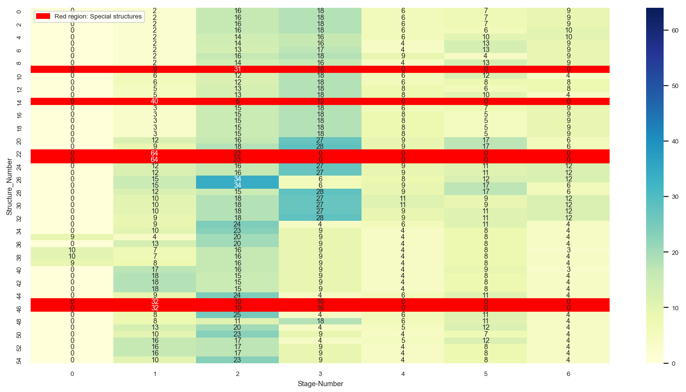
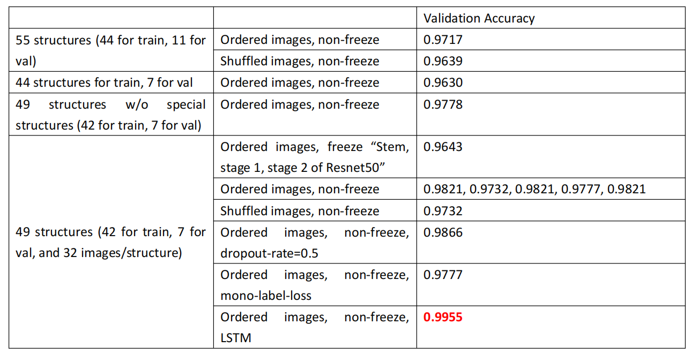
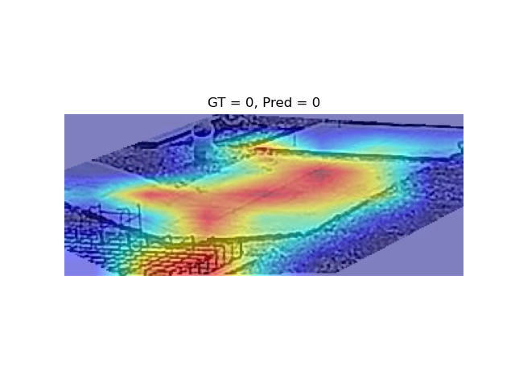
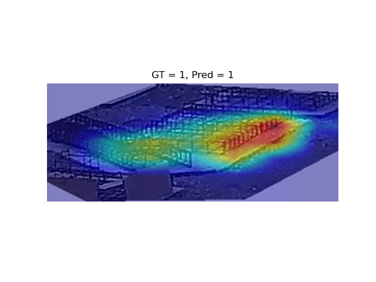
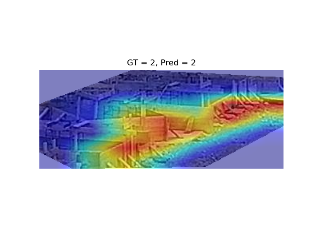
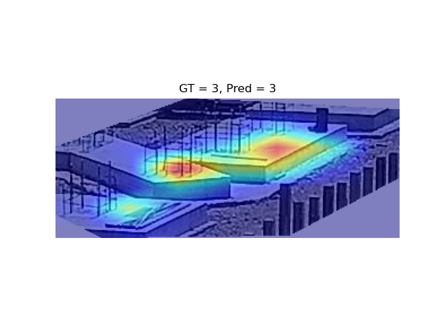
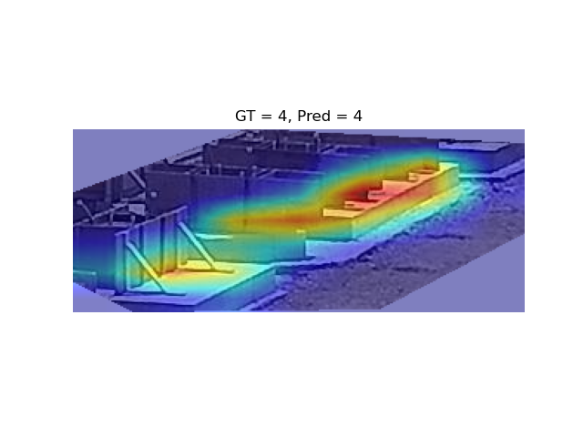
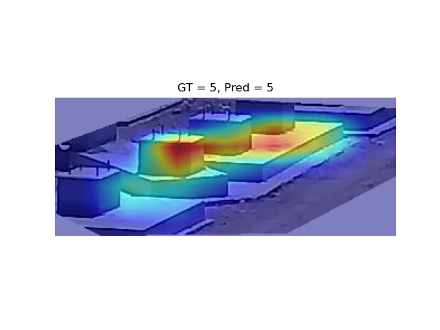
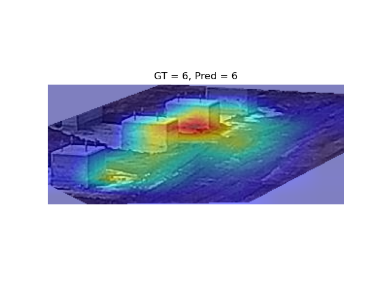

# Structure_Series_Image_Classification

## Data Preprocessing
Using the Python files in data_preprocessing folder to do data preprecessing:
1. data_cleaning.py -> matching GT to images.
2. data_statistics_calculation.py -> calculating the statistics of stage numbers for all structures.
3. image_labels_gathering.py -> making Train and Val dataset
4. images_labels_series_gathering.py -> uniformly select 32 labels and corresponding images for training LSTM as an auxiliary task to improve the classification accuracy.

## Classification

## Visualization

<table>
  <tr>
    <td align="center"></td>
    <td align="center"></td>
    <td align="center"></td>
    <td align="center"></td>
  </tr>
  <tr>
    <td align="center"></td>
    <td align="center"></td>
    <td align="center"></td>
  </tr>
</table>

## To Do
More **robust**:
1. K-Fold Validation
2. Data Augmentation
3. Data Quality Improvement (Place a **Marker** after each stage is completed, which is an important feature for distinguishing different stages.)

More **accurate**:
1. Using attention mechanism to highlight the "End-State".
2. Using "Weights-and-Bias" for hyperparameters tunning.

More **convinient**:
1. Trade-off between the *Model-Size* and *Classification-Accuracy*.
2. Direct object detection to save "ROI-Cropping".
